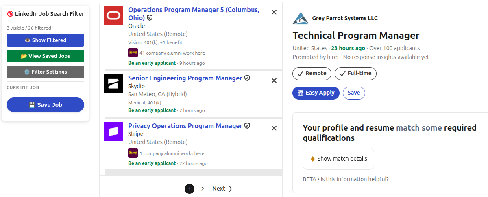
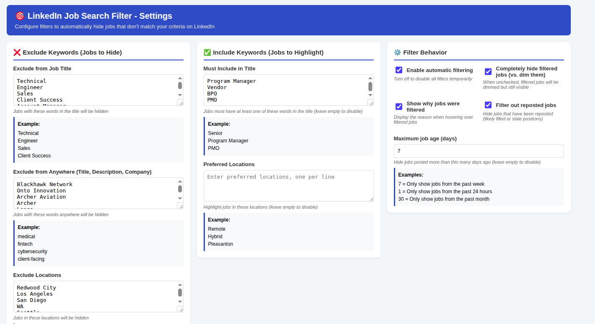

# LinkedIn Job Search Filter

Spend less time scrolling through jobs you already know you don't want.

**Free · No account · No tracking · Data stays local**

A free Chrome/Brave extension for LinkedIn job search. It filters out
titles and terms you don't want, lets you prefer the titles and
locations you do want, hides reposted and stale listings, and saves
jobs locally with one click - all running entirely in your own browser.

*Independent project; not affiliated with or endorsed by LinkedIn.*

## Why I built it

LinkedIn's own search filters only go so far - reposted listings and
titles I'd already ruled out kept eating time I wanted to spend on jobs
that actually fit. This started as a script for my own job search and
turned into something worth sharing with other job seekers going
through the same scroll.

## What it does

✅ **Filter unwanted titles** - hide listings whose title matches terms you don't want
✅ **Filter unwanted terms anywhere** - not just the title; company, location, and description text too
✅ **Prefer what you want** - include/highlight specific titles and locations
✅ **Filter reposted jobs** - hide listings LinkedIn shows as reposted
✅ **Filter by age** - hide jobs older than a maximum posting age you choose
✅ **Save jobs locally, one click** - with CSV export and re-import
✅ **Duplicate detection** - saving or importing a job you've already saved is recognized and skipped

**No account. No analytics or tracking of any kind. Your data never
leaves your browser.** See [Privacy & Data](#privacy--data) below for
exactly what's stored and where.

**LinkedIn only**, and compatibility is best-effort - LinkedIn changes
its page structure without notice, and the selectors this extension
relies on can break as a result. See
[Known Limitations](#known-limitations).

## Screenshots


*The floating panel on a LinkedIn job search page - draggable by its header, out of the way of LinkedIn Chat or anything else.*


*The settings page, where filters are configured.*

## Installation

This extension is not published on the Chrome Web Store - it's loaded
as an unpacked extension in Developer Mode. You'll need Chrome, Brave,
or another Chromium-based browser.

### Option 1: Download the ZIP (recommended)

1. Download the latest release ZIP from the
   [Releases page](https://github.com/charlesmomeny/linkedin-job-search-filter/releases)
2. Unzip it to a folder on your computer
3. Go to `chrome://extensions/`
4. Enable **Developer mode** (toggle, top right)
5. Click **Load unpacked** and select the unzipped folder
6. Confirm you see "LinkedIn Job Search Filter" in your extensions list

### Option 2: Clone with Git (for developers)

1. `git clone https://github.com/charlesmomeny/linkedin-job-search-filter.git`
2. Go to `chrome://extensions/`, enable **Developer mode**, click
   **Load unpacked**, and select the cloned folder

## Privacy & Data

Everything this extension does happens locally in your browser. It makes
no network requests of any kind - there is no analytics, telemetry, or
server component, and nothing you save or configure is ever sent
anywhere.

**What's stored**, in your browser's local extension storage
(`chrome.storage.local`), never synced or exported unless you explicitly
click "Export to CSV":
- `savedJobs` - the jobs you've clicked "Save Job" on (title, company,
  location, URL, source, date saved)
- `filterSettings` - your keyword/location/repost/age filter preferences
- `panelPosition` - where you last dragged the floating panel to, so it
  stays out of your way on future visits

**Historical data note**: an earlier version of this extension included
an Easy Apply autofill feature that stored profile information locally
(name, contact details, and EEO fields like veteran/disability status,
gender, and race) under separate storage keys. That feature has been
removed and none of that data is read, displayed, or used by the current
code. If you used that older version, those values may still be sitting
untouched in your local browser storage - they were never sent anywhere
then either, but if you'd like to remove them, open a LinkedIn tab,
press F12, and run this in the console:
```javascript
chrome.storage.local.remove(['profileData', 'fieldMappings', 'unknownFields'])
```
This only clears the old profile data - it leaves your saved jobs and
filter settings untouched.

## Known Limitations

- **LinkedIn only.** Earlier versions supported additional sites; that
  support has been removed and is not currently planned to return.
- **Best-effort DOM compatibility.** LinkedIn changes its page structure
  without notice, and the selectors this extension relies on can break
  as a result. See [Site Adapter May Need Adjustment](#site-adapter-may-need-adjustment)
  below.
- **Exact-match duplicate detection only.** There is no fuzzy/"similar
  job" matching - two listings are only recognized as duplicates when
  their source and job ID (or title/company/location) match exactly.
- **Reposted/age filtering depends on LinkedIn showing that information
  as visible text on the job card.** If LinkedIn changes how or whether
  it displays a "Reposted" label or a posting date, these filters may
  stop having any effect until the detection logic is updated.
- **No sync.** Saved jobs and settings live only in the local browser
  profile they were saved in; nothing is backed up automatically (use
  Export to CSV for that).

## File Structure

```
linkedin-job-search-filter/
├── manifest.json          # Extension configuration
├── site-adapters.js       # LinkedIn-specific DOM/extraction logic
├── content-universal.js   # Main content script (init, filtering, saving, panel/drag)
├── panel-drag-utils.js    # Pure clamping math behind the draggable panel
├── job-identity.js        # Saved-job identity/deduplication logic
├── keyword-matching.js    # Safe literal keyword matching for filters
├── lifecycle-utils.js     # Observer/timer lifecycle helpers
├── job-freshness.js       # Reposted / posting-age detection
├── csv-utils.js           # CSV parsing for popup import
├── url-utils.js           # Job URL scheme validation
├── popup.html             # Saved jobs viewer
├── popup.js               # Popup logic (list, export/import, delete)
├── options.html           # Settings page
├── options.js             # Settings logic
├── background.js          # Background service worker
├── styles.css             # Button styles
└── icons/                 # Extension icons (icon-16/32/48/128.png, icon-master.png)
```

## Setup Instructions

### Test the Extension

#### Testing on LinkedIn
1. Visit https://www.linkedin.com/jobs/search/
2. You should see a "🎯 LinkedIn Job Search Filter" panel on the right side - drag it by the header if it's in the way of LinkedIn Chat or anything else
3. Open a job listing
4. Click the "💾 Save Job" button
5. Check that the job appears in the extension popup

## Important Notes

### Site Adapter May Need Adjustment

LinkedIn's HTML structure changes frequently, so the adapter's selectors are best-effort and may occasionally need updating. If the extension doesn't work correctly, you may need to:

1. **Inspect the HTML** of the job pages using Chrome DevTools (F12)
2. **Update the selectors** in `site-adapters.js` for LinkedIn
3. **Look for**:
   - Job card elements in search results
   - Job title, company, and location elements
   - Unique class names or data attributes

### Common Issues & Solutions

**Problem**: Filter panel doesn't appear
- **Solution**: Check the browser console (F12) for errors
- The site might use a different URL structure

**Problem**: Job details aren't extracted correctly
- **Solution**: Update the selectors in the appropriate adapter in `site-adapters.js`
- Look for elements with class names like "job-title", "company-name", "location"

**Problem**: Jobs aren't appearing in search results
- **Solution**: The adapter's `getJobCards()` method needs to target the correct elements
- Inspect the page and find the container elements for job listings

### Customizing the Selectors

To customize LinkedIn's selectors:

1. Open `site-adapters.js`
2. Find the `linkedin:` adapter
3. Update these methods:
   - `getJobCards()`: Returns array of job card elements
   - `extractJobData()`: Extracts title, company, location from detail page
   - `extractJobDataFromCard()`: Extracts data from search result cards

Example:
```javascript
getJobCards() {
  // Update this selector to match the actual HTML structure
  return Array.from(document.querySelectorAll('.actual-job-card-class'));
}
```

## How to Use

### Saving Jobs

1. **Browse jobs** on LinkedIn
2. **Click "💾 Save Job"** on any job detail page
3. **View saved jobs** by clicking the extension icon

### Filtering Jobs

1. **Click the extension icon** to open settings
2. **Add keywords** to exclude or require in job titles
3. **Add locations** to filter or highlight
4. **Go to a job search page** and see filtered results

### Managing Saved Jobs

1. **Click the extension icon** to view all saved jobs
2. **Export to CSV** to download your job list
3. **Delete jobs** individually or clear all at once

## Testing Checklist

- [ ] Extension installs without errors
- [ ] Filter panel appears on LinkedIn job search
- [ ] Panel can be dragged by its header and stays within the viewport
- [ ] Save button appears on LinkedIn job detail pages
- [ ] Jobs save successfully on LinkedIn
- [ ] Saved jobs appear in popup with correct source badges
- [ ] CSV export includes all jobs with source column
- [ ] Filters work on LinkedIn

## Troubleshooting

### Console Logging

The extension logs helpful information to the browser console. To view logs:

1. Open a job site
2. Press F12 to open DevTools
3. Go to the Console tab
4. Look for messages starting with "Job Saver:"

### Common Log Messages

- `Job Saver: Initializing for [Site Name]` - Extension is loading
- `Job Saver: Found X job cards` - Job filtering is working
- `Job Saver: Saved job:` - Job was saved successfully
- `Job Saver: Error...` - Something went wrong (check the error details)

### Debugging Tips

1. **Check the manifest**: Ensure all URLs are correct
2. **Verify permissions**: The extension needs access to linkedin.com
3. **Reload the extension**: After making changes, click the reload icon in chrome://extensions/
4. **Clear storage**: If things seem broken, clear the extension's storage:
   ```javascript
   // In browser console on linkedin.com:
   chrome.storage.local.clear()
   ```

## Advanced Configuration

### Filter Settings

Configure filters in the extension options:
- **Exclude Keywords**: Hide jobs containing these words
- **Include Keywords**: Only show jobs with these words
- **Exclude Locations**: Hide jobs in certain locations
- **Include Locations**: Highlight jobs in preferred locations
- **Reposted Jobs**: Hide listings LinkedIn shows as reposted
- **Maximum Job Age**: Hide jobs posted more than a set number of days ago

## Support

If you encounter issues:

1. **Check the console** for error messages
2. **Verify site structure** hasn't changed (inspect HTML)
3. **Update selectors** in `site-adapters.js` as needed
4. **Test with simple cases** first (e.g., just saving one job)

## Future Enhancements

Possible improvements:
- Sync saved jobs across devices
- Integration with job tracking tools
- Advanced filtering (remote/hybrid, etc.)
- Job application tracking

## License

No license has been chosen yet - all rights are reserved by default
under standard copyright until one is added. This section will be
updated once a license is selected.
